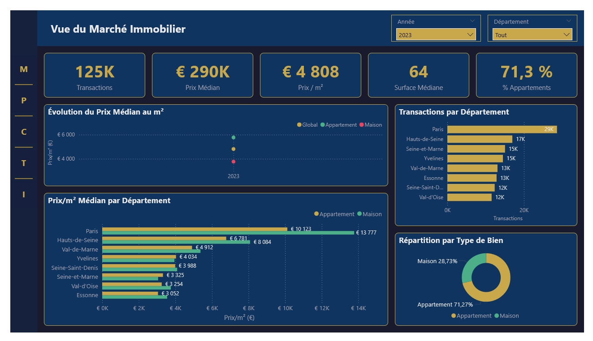

# 🏠 Analyse Marché Immobilier IDF — Power BI

## 📊 Aperçu

Dashboard d'analyse du marché immobilier francilien basé sur
les données officielles DVF (Demandes de Valeurs Foncières)
couvrant 925 138 transactions sur 8 départements d'Île-de-France
de 2019 au T2 2025.

## 🎯 Contexte Business

Analyser l'évolution du marché immobilier IDF pour identifier
les tendances de prix, les disparités géographiques et les
drivers du prix au m² par département et type de bien.

## ❓ Questions Business Traitées

1. Quelle est l'évolution du prix médian au m² par département ?
2. Quelles communes affichent les prix les plus élevés ?
3. Quels facteurs influencent le prix au m² en IDF ?
4. Comment évoluent les volumes de transactions dans le temps ?
5. Quelles sont les disparités Appartement vs Maison ?

## 🛠️ Stack Technique

| Outil | Usage |
|-------|-------|
| Power BI Desktop | Modélisation & Dashboard |
| Power Query (M) | ETL & Nettoyage |
| DAX | Calculs & KPIs |
| JSON | Thème personnalisé sombre |

## 📐 Architecture Data

Modèle en étoile (Star Schema) :

- 1 table de faits : fact_Immo (925 138 lignes)
- 2 dimensions : dim_Commune (1 297 communes),
                 dim_Calendrier
- 1 table de mesures : _Mesures (21 mesures DAX)

## 📈 KPIs Principaux

| KPI | Valeur |
|-----|--------|
| Transactions totales | 925 138 |
| Prix Médian IDF | ~300 000 € |
| Prix/m² Médian | ~5 455 € |
| Surface Médiane | 61 m² |
| % Appartements | 76,6% |
| Dept le Plus Cher | Hauts-de-Seine |

## 🔍 Fonctionnalités Avancées Power BI

- **Thème JSON sombre personnalisé** — palette bleu nuit
  et dorée #C9A84C
- **Navigation latérale** — menu vertical avec boutons
  et séparateurs
- **Carte géospatiale** — 1 297 communes géocodées
- **Decomposition Tree** — analyse interactive des drivers
  du prix/m²
- **Bookmarks** — sélection 2023 par défaut sur toutes
  les pages
- **HASONEVALUE** — mesures YoY robustes

## 🗂️ Structure du Projet

    immobilier-idf/
    ├── data/
    │   └── source_dvf.md      (liens téléchargement DVF)
    ├── powerbi/
    │   ├── immobilier_idf.pbix
    │   └── Immobilier_Theme.json
    ├── screenshots/
    │   ├── 01_Vue_Marche.png
    │   ├── 02_Analyse_Prix.png
    │   ├── 03_Carte_Interactive.png
    │   ├── 04_Tendances_Marche.png
    │   └── 05_Analyse_Drivers.png
    └── README.md

## 📄 Pages du Dashboard

| Page | Contenu |
|------|---------|
| Vue du Marché | KPIs globaux, évolution prix, volumes par département |
| Analyse des Prix | Distribution, prix/m² par surface, matrice, scatter |
| Carte Interactive | Géolocalisation 1 297 communes, Top 5, comparaison |
| Tendances du Marché | Évolution trimestrielle, volumes annuels |
| Analyse des Drivers | Decomposition Tree, disparités départementales |

## ✅ Qualité des Données

- Source : DVF+ Open Data — Cerema (données officielles DGFiP)
- Périmètre : 8 départements IDF (75, 77, 78, 91, 92, 93, 94, 95)
- Période : 2019-T2 2025
- Filtres qualité appliqués :
  - Uniquement ventes (hors donations, successions)
  - Appartements et maisons uniquement
  - Prix > 0€ et Surface > 0m²
  - Prix/m² entre 500€ et 30 000€
- Coordonnées géographiques : source La Poste (WGS84)

## 📌 Décisions Techniques

- Colonnes de tranches créées en Power Query
  (performances optimales sur 925K lignes)
- dim_Commune issue de la Base Officielle des Codes Postaux
  La Poste pour les coordonnées WGS84
- HASONEVALUE systématique sur mesures Time Intelligence
- Thème JSON pour cohérence visuelle automatique

## 🔗 Sources

- [DVF+ Open Data — Cerema]
  (https://cerema.app.box.com/v/dvfplus-opendata)
- [Base Officielle Codes Postaux — La Poste]
  (https://www.data.gouv.fr/datasets/communes-de-france-base-des-codes-postaux)
- [Microsoft PL-300 Certification]
  (https://learn.microsoft.com/fr-fr/certifications/exams/pl-300)
