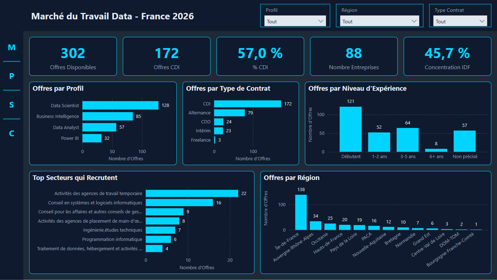

# 💼 Analyse du Marché du Travail Data — Power BI

## 📊 Aperçu

Dashboard d'analyse du marché du travail Data en France
basé sur 302 offres d'emploi extraites en temps réel
via l'API officielle France Travail (avril 2026).

## 🎯 Contexte Business

Analyser le marché de l'emploi Data en France pour identifier
les profils les plus demandés, les conditions salariales,
la répartition géographique et les secteurs qui recrutent.

## ❓ Questions Business Traitées

1. Quels profils Data sont les plus recherchés en France ?
2. Quels niveaux d'expérience sont demandés par profil ?
3. Quelles sont les conditions salariales du marché ?
4. Quelle est la répartition géographique des offres ?
5. Quels secteurs recrutent le plus de profils Data ?

## 🛠️ Stack Technique

| Outil | Usage |
|-------|-------|
| Python | Extraction API + nettoyage données |
| Power BI Desktop | Modélisation & Dashboard |
| Power Query (M) | ETL & Nettoyage |
| DAX | Calculs & KPIs |
| JSON | Thème personnalisé |
| API France Travail | Source de données temps réel |

## 🔄 Pipeline de données
API France Travail
↓
extract_offres.py      (extraction ~300 offres)
↓
extract_offres_complement.py  (mots clés complémentaires)
↓
merge_offres.py        (fusion + déduplication)
↓
fix_offres_v2.py       (nettoyage + enrichissement)
↓
offres_data_final.csv  (302 offres propres)
↓
Power BI Desktop       (modélisation + dashboard)

## 📐 Architecture Data

Modèle en étoile (Star Schema) :

- 1 table de faits : fact_Offres (302 lignes)
- 2 dimensions : dim_Localisation (123 lignes),
                 dim_Calendrier
- 1 table de mesures : _Mesures (19 mesures DAX)

## 📈 KPIs Principaux

| KPI | Valeur |
|-----|--------|
| Offres analysées | 302 |
| % CDI | 62,9% |
| % Alternance | 26,2% |
| Salaire Médian | 43 000 € |
| % Offres IDF | 45,7% |
| % Offres avec Salaire | 18,9% |

## 🔍 Insights Clés

- **Data Scientist** est le profil le plus demandé (42%)
  suivi de **Business Intelligence** (28%)
- **"Data Engineer"** n'apparaît pas sur France Travail —
  le marché français utilise des termes différents
- **62,9% des offres sont en CDI** — marché stable
- **45,7% des offres sont en IDF** — forte concentration
  parisienne
- **Salaire médian à 43K€** sur les offres renseignées
  (seulement 19% des offres mentionnent un salaire)
- **79 offres d'Alternance** détectées via analyse
  des titres d'offres

## 🗂️ Structure du Projet

    marche-travail-data/
    ├── data/
    │   └── offres_data_final.csv
    ├── scripts/
    │   ├── extract_offres.py
    │   ├── extract_offres_complement.py
    │   ├── merge_offres.py
    │   ├── clean_offres.py
    │   └── fix_offres_v2.py
    ├── powerbi/
    │   ├── marche_travail.pbix
    │   └── MarcheTravail_Theme.json
    ├── screenshots/
    │   ├── 01_Vue_Marche.png
    │   ├── 02_Analyse_Profils.png
    │   ├── 03_Salaires_Conditions.png
    │   └── 04_Carte_Geographique.png
    └── README.md

## 📄 Pages du Dashboard

| Page | Contenu |
|------|---------|
| Vue du Marché | KPIs globaux, profils, contrats, expérience, secteurs, régions |
| Analyse des Profils | Profils × Expérience, Profils × Type Contrat |
| Salaires & Conditions | Salaires par profil/expérience, CDI vs Alternance |
| Carte Géographique | Carte nationale, Top 6 villes, offres par région |

## ✅ Qualité des Données

- Source : API France Travail (données officielles)
- Extraction : avril 2026 — offres des 31 derniers jours
- Mots clés : Data Analyst, Business Intelligence,
  Power BI, Data Scientist, Analyste données,
  Analyste BI
- Nettoyage : parsing salaires, normalisation villes,
  détection alternance via titres d'offres
- Limitation : 18,9% de salaires renseignés
  (pratique courante du marché français)

## 📌 Décisions Techniques

- Alternance détectée via analyse des titres
  (non présente dans les métadonnées France Travail)
- Colonnes de tri créées en Power Query
  pour éviter les dépendances circulaires DAX
- Thème JSON pour cohérence visuelle automatique
- Navigation latérale — onglets masqués

## 🔗 Sources

- [API France Travail]
  (https://francetravail.io/data/api)
- [Microsoft PL-300 Certification]
  (https://learn.microsoft.com/fr-fr/certifications/exams/pl-300)
